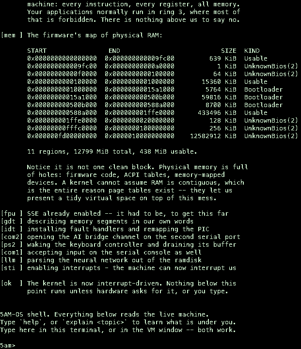
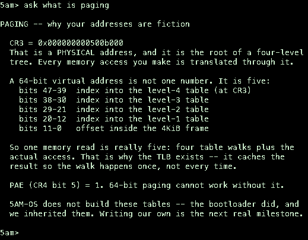
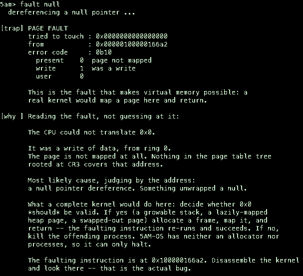
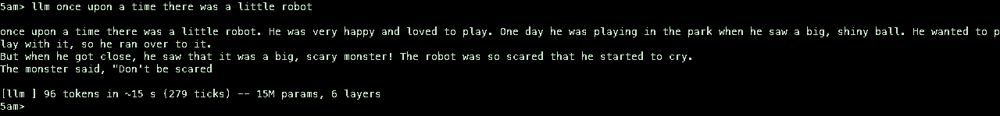

# 5AM-OS

An x86_64 kernel, written in Rust, whose purpose is to **explain itself**.

Most teaching operating systems are a normal kernel plus a textbook. This one
puts the teaching inside the machine: it narrates its own boot, and its shell
reads live CPU state to explain what is under you. `explain gdt` does not print
a description of a GDT — it asks the CPU where its GDT is, walks it, and decodes
the bytes that are actually there.

<p align="center">
  
</p>

<p align="center"><em>Booting on its own framebuffer console — every character
drawn a pixel at a time from a bitmap in <code>font.rs</code>.</em></p>

```
5am> explain rings
PRIVILEGE RINGS
  x86 has four; everyone uses two.

  Current CS = 0x0008 -> ring 0

  Ring 0 can execute any instruction, read any register,
  touch any memory. Ring 3 cannot do I/O, cannot load
  descriptor tables, cannot disable interrupts. Every
  program you have ever run was in ring 3, asking a ring 0
  kernel for permission. You are currently the thing that
  grants permission.
```

---

## Running it

Needs Rust nightly and QEMU. Nothing else — no cross-compiler, no linker to
build.

```bash
rustup toolchain install nightly
brew install qemu          # or your platform's package manager
```

```bash
./run.sh
```

That builds the kernel for bare metal, wraps it in a bootable disk image, and
boots it in QEMU with the serial console attached to your terminal. **Type
straight into the terminal** — the shell reads the serial port as well as the
PS/2 keyboard. Quit with **Ctrl-A** then **X**.

`./run.sh --gui` also opens a QEMU window; keystrokes there go to the emulated
keyboard instead. Both drive the same shell.

The first build compiles `core` from source (see below) and takes a few minutes.
Boot then takes ~90 seconds, almost all of it the bootloader pulling 58 MB of
model weights through BIOS disk services before the kernel ever runs.

---

## Running it somewhere other than QEMU

`5am-os-bios.img` is a **real BIOS-bootable disk image**, not a QEMU-specific
artifact. It will boot in VirtualBox, VMware, Hyper-V, or off a USB stick on
actual hardware.

```bash
# VirtualBox
VBoxManage convertfromraw 5am-os-bios.img 5am-os.vdi --format VDI

# VMware
qemu-img convert -O vmdk 5am-os-bios.img 5am-os.vmdk

# Hyper-V — must be a Generation 1 VM (Gen 2 is UEFI, and the UEFI image
# is disabled; see Known limitations)
qemu-img convert -O vpc 5am-os-bios.img 5am-os.vhd
```

Give the VM **at least 512 MB** of RAM: 58 MB of weights, ~10 MB of static
buffers, and the kernel itself.

Output goes to **both** the screen and the serial port, and input is accepted
from **both** the keyboard and the serial port — so a VM with no serial
configured works exactly as you would expect, and a headless one still does too.
Serial remains the primary console because it works before the display is
claimed and keeps working when the display does not.

The guest does not care what host it runs on: the kernel is x86_64 and behaves
identically on macOS, Linux, or Windows. What *is* host-specific is the build
tooling — `run.sh` is a bash script, so on Windows use WSL2 or Git Bash.

On an x86_64 host with hardware virtualisation (KVM on Linux, WHPX on Windows,
`-accel hvf` on an Intel Mac) it runs *far* faster than it does here, where an
ARM Mac is emulating x86 instruction by instruction.

---

## What it does so far

| Subsystem | State | What it taught |
| --- | --- | --- |
| Serial (16550 UART) | working | Port I/O, and why serial outlives every other console |
| Boot narration | working | What the firmware and bootloader did before our first instruction |
| GDT + TSS | working | Segmentation's remains in 64-bit mode; privilege levels |
| IST stack | working | Why a stack overflow reboots a machine, and how to survive it |
| IDT + exceptions | working | Faults you can handle vs. faults that end you |
| PIC + timer | working | Why the 8259's defaults collide with Intel's own vectors |
| PS/2 keyboard | working | Scancodes are not characters; layouts are software |
| Shell | working | — |
| Serial console input | working | The same shell over a wire, a window, or SSH |
| Framebuffer console | working | Below a terminal there are only pixels |
| Physical frame allocator | working | The free list lives inside the free memory |
| Page tables | working | Four table reads to resolve one address |
| Heap allocator | working | The line where `Vec` and `String` start existing |
| FPU / SSE | working | The CPU boots unable to do float math |
| Answer engine | working | Decoding hardware beats guessing about it |
| Transformer (15M) | working | Real inference in ring 0, nothing linked in |
| AI bridge (COM2) | optional | Serial is the kernel's only reach into the outside world |
| Preemptive multitasking | working | A task is register values plus a stack, nothing more |
| Ring 3 + syscalls | working | Privilege is one field in a descriptor, enforced by hardware |
| ELF loader | working | Segments are for the loader; sections are for the linker |
| ATA PIO disk | working | The CPU personally carries every byte |
| FAT16 (read-only) | working | A file is a linked list living in a table |
| Locks | working | A kernel lock exists to stop re-entrancy, not just parallelism |
| No-execute pages | working | A permission the CPU ignores until you ask it not to |
| Blocked tasks, sleep | working | A scheduler you can tell "not this one, not yet" |
| Semaphores | working | Mutual exclusion that sleeps instead of spinning |

### Shell commands

```
help              this list
explain <topic>   read the machine and explain a subsystem
                  topics: boot gdt idt interrupts paging rings serial keyboard
regs              live control registers
gdt               decode every GDT entry
idt               which interrupt vectors are wired up
mem               physical memory map from the firmware
uptime            timer ticks since boot
fault <kind>      break something: int3 | div0 | page | null | wild | stack
ask <question>    ask the kernel about itself -- answered inside this
                  machine, no network and no host process
bridge <question> send the question to a host process over COM2 instead
tasks             every task slot, its state and how often it was switched to
spawn <prompt>    run a generation on its own stack and keep your prompt
clear             clear the screen
```

`fault stack` is the interesting one. It recurses until the kernel stack runs
out, which faults, and faulting while handling a fault is a **double fault**.
Without a known-good stack to land on, that becomes a triple fault and the
machine silently resets. 5AM-OS survives it and tells you why:

```
5am> fault stack
  recursing until the stack runs out ...

[trap] DOUBLE FAULT at 0x10000005098
       A fault occurred while handling a fault.
       Reached this handler on the IST stack, which is the only
       reason you are reading this instead of watching a reboot.
```

---

## Asking the kernel about itself

`ask` is answered **entirely inside 5AM-OS**. No network, no host process,
nothing to install:

```
5am> ask why is cr3 not the same as where my kernel loaded

PAGING -- why your addresses are fiction

  CR3 = 0x0000000001195000
  That is a PHYSICAL address, and it is the root of a four-level tree.
  ...
```

<p align="center">
  
</p>

**It is not a model, and it says so** — run `ask how do you work`. It is keyword
matching over a hand-written corpus plus decoders that read live registers.
Every sentence was written by a human; every number came out of the hardware a
moment ago.

That trade is deliberate. What it gives up in flexibility it gains in being
*correct*, which is exactly what you want when the machine has just crashed:

```
5am> fault null

[trap] PAGE FAULT
       tried to touch : 0x0000000000000000
...
[why ] Reading the fault, not guessing at it:

       It was a write of data, from ring 0.
       The page is not mapped at all.

       Most likely cause, judging by the address:
       a null pointer dereference. Something unwrapped a null.
```

<p align="center">
  
</p>

It decodes the real error-code bits and classifies the real faulting address, so
it distinguishes a null dereference from an unmapped page from a malformed
pointer — and it cannot invent a confident wrong answer, because it cannot
invent anything.

Writing `fault wild` taught the engine something true: a non-canonical address
raises a **general protection fault**, not a page fault, because the CPU rejects
the pointer shape before it ever consults the page tables. `#GP` carries no CR2,
so the engine reads the error code's selector fields instead.

---

## Memory management

This is the part that turns a booting machine into something that can host
programs, and it is three separate ideas that get conflated:

**Knowing which memory is free.** The firmware hands over a fragmented map of
physical RAM; `memory.rs` walks it and threads a free list *through the free
frames themselves* — each free frame's first eight bytes hold the address of the
next one. That costs zero bookkeeping memory, which matters because at that
point in boot there is nowhere to put any.

**Making an address mean something.** Page table entries hold *physical*
addresses, but every address the kernel uses is virtual — so to read the table
whose address is in CR3, you need a virtual address that reaches it, and you
cannot make one without first reading the table. The escape is to have the
bootloader map all of physical memory at a known offset before the kernel
starts. That one config line is what makes paging implementable at all.

**Handing out pieces.** `heap.rs` maps 2 MiB and manages it with an
address-sorted free list that merges adjacent holes on free.

```
5am> heap
  physical frames : 110420 free of 110936
  heap            : 2097152 bytes free in 1 hole(s), 0 live allocation(s)

  A Vec, grown at runtime : [1, 4, 9, 16, 25, 36, 49, 64]
  Its heap address        : 0x444444440010

  400 alloc/free cycles, interleaved:
    before : 2097152 bytes free, 1 hole(s)
    during : 2054160 bytes free, 3 hole(s)
    after  : 2097152 bytes free, 1 hole(s)
```

That last block is the test that matters. An allocator that allocates is easy;
one whose free list survives churn is the point. The first version here did not
coalesce — `free` just pushed onto the head of the list — and it would have
degraded until a large allocation failed with megabytes nominally free.

You can also watch a translation happen:

```
5am> translate 444444440000
    level 4  entry 0x000000001ffde023  -> frame 0x1ffde000 writable
    level 3  entry 0x000000001ffdd023  -> frame 0x1ffdd000 writable
    level 2  entry 0x000000001ffdc023  -> frame 0x1ffdc000 writable
    level 1  entry 0x000000001ffdf063  -> frame 0x1ffdf000 writable

  physical 0x000000001ffdf000
```

Four table reads for one address. That is what the TLB caches.

---

## Doing two things at once

The transformer takes about fifteen seconds to answer. For most of this
project's life that meant the machine was simply gone for fifteen seconds --
keystrokes still reached the interrupt handler and piled up in a buffer, but
nothing read them, because the shell *was* the code running the transformer.

`task.rs` fixes that, and the fix is smaller than it sounds. **A task is
register values plus a stack.** To switch, you push every register onto the
stack you are on, remember that stack pointer, load a different one, and pop.
The pops restore somebody else's registers, and execution continues as them.

The timer interrupt is the only handler here not written with Rust's
`extern "x86-interrupt"` ABI. That ABI writes its own prologue and epilogue,
which is correct when a handler returns to whatever it interrupted -- and
useless when the entire point is to return somewhere else. So vector 32 is
hand-written assembly that pushes fifteen registers in a known order, passes
`rsp` to Rust, and resumes on whatever Rust passes back:

```
mov rdi, rsp
call schedule
mov rsp, rax
```

Three instructions. That is multitasking.

A brand-new task has no saved registers, so `spawn` forges some: a fake
interrupt frame with the entry point where the return address goes, and zeros
below it. The first switch pops the zeros and `iretq`s into a function nobody
ever called.

```
5am> spawn once upon a time there was a small robot
  [task 1 started -- the prompt is still yours]
5am>
once upon a time there was a small robot. He was very happytasks
  id  name      state     switches
  0   shell     running   46
  1   llm       ready     46
5am>  and loved to play. One day he was playing in the park when he sawuptime
  223 ticks  (~12 seconds at the PIT's default 18.2 Hz)
5am>  a little girl. She was playing with a ball and the robot wanted to playtasks
  id  name      state     switches
  0   shell     running   137
  1   llm       ready     137
```

The output is interleaved because it genuinely is: the network writes a token,
the timer takes the CPU away mid-sentence, the shell answers you, and the timer
hands it back. Both counters climb together because a switch away from one is a
switch into the other.

### What this cost

One bug, and it is worth writing down. The first `spawn` faulted immediately --
`#GP`, error code 0, at an ordinary kernel address. Error code 0 in 64-bit mode
usually means a non-canonical pointer, so I went looking for corruption that was
not there.

It was alignment. The SysV ABI does not promise a function 16-byte alignment at
its first instruction. It promises the stack was 16-aligned *before* the `call`,
and the `call` pushed eight bytes of return address -- so every function begins
with `rsp % 16 == 8`, and the compiler emits `movaps` on that assumption. The
forged frame handed the task a cleanly aligned `rsp`, every SSE spill was off by
eight, and a misaligned `movaps` surfaces as `#GP` with nothing in it that
mentions alignment.

The fix is one subtraction. Finding it was a day.

---

## Leaving ring 0

Everything above this point runs at the highest privilege the CPU has. `explain
rings` has been describing ring 3 since the first week of this project, entirely
from the outside. `user` goes there.

```
5am> user
  Mapping two pages that ring 3 is allowed to touch:
    code  0x200000  user, read-execute
    stack 0x210000  user, read-write
    code page sealed read-only, with the program already in it

  Dropping to ring 3. Nothing below this line is privileged.

  hello from ring 3 -- printed by a syscall

  [syscall] the caller reports cs = 0x33
            low two bits = 3, so it is running in ring 3
            the kernel's own cs is 0x8, ring 0
  [syscall] write(0x100000000000, 16) REFUSED
            that address is not user-accessible.
  [syscall] exit(0) -- leaving ring 3

  Back in ring 0, by way of 4 syscalls.
```

### What ring 3 actually costs the code running in it

Surprisingly little. Same instructions, same registers, same address space.
Three things change:

- `cli`, `hlt`, `in`, `out`, `lgdt`, writes to CR3 — anything that touches the
  machine rather than the program — raise `#GP` instead of working.
- Pages without the user bit are unreachable, even to read.
- There is exactly one way to ask for anything: an interrupt.

That last one is the design. A user program *cannot call* the kernel, because
calling means jumping to an address and the kernel's addresses are not reachable
from ring 3. It can only raise an interrupt and let the CPU decide where that
lands — and the CPU decides from the IDT, which the kernel owns. The kernel
picks its own entry points. The boundary is hardware, not agreement.

### There is no instruction for "lower your privilege"

The only way down is to return from an interrupt that never happened: build a
trap frame claiming we came from ring 3, and `iretq` into the lie. The CPU
checks the RPL of the CS being restored, sees 3, and obliges.

And the only way back up is the exit syscall. That is not a design choice so
much as a consequence — nothing in ring 3 can name a kernel address to jump to.

### The check that makes this a kernel

`write` takes a pointer chosen by code we do not trust. If it names a kernel
page, dereferencing it leaks kernel memory to ring 3 through a completely
legitimate-looking interface: the program never left its sandbox, it just asked
the kernel to reach out of one. So every syscall pointer is walked through the
page tables first, and the user bit checked at every level.

Most programs that trip this are not attacking anything. They just have a stale
pointer. A kernel that trusts them either way has no isolation, only the
appearance of some.

### What this cost

Three faults, all mine, all instructive.

The one I am least proud of: `exit` restores a saved RSP and returns rather than
going back through `iretq`, and nothing on that path restored the kernel's
`RFLAGS`. Ring 3 runs with `IF` clear by design — so the kernel came back with
**interrupts disabled permanently**. No timer, no scheduler, no keyboard IRQ.

What makes it worth writing down is why it survived three rounds of testing: the
program's output is already printed by the time it happens. The transcript looks
perfect. The machine is simply deaf afterwards, and everything typed next goes
into a buffer nothing will ever read. I checked the output, saw exactly what I
expected, and moved on — three times. It surfaced only when a test happened to
run `exec` twice and the second one never appeared.

A passing transcript is not a passing test if you only wrote down what you were
hoping to see.

The code page was mapped read-only from the start — and the kernel's own copy
*into* it faulted. `CR0.WP` means ring 0 is subject to the read-only bit too,
which is the entire reason that bit is worth setting. The fix is what a real
loader does: map writable, copy, then seal.

Then the program faulted at `0x2c` reading a null-ish address. `mov rsi, label`
in Intel syntax is a load *from* that address, not the constant — and `0x2c`
was the message length. The fault pointed at the first page; the bug was an
addressing mode.

---

### Loading a program it did not compile

`userland/` is a separate crate. It is compiled on its own, linked on its own,
and cannot see a kernel symbol — the only things the two share are the number in
`int 0x80` and which registers carry what. That is an ABI, and it is the
smallest honest example of one I could build.

What arrives at the kernel is an ELF file, and the kernel has to read it:

```
5am> user
  The program is a 13016 byte ELF file, built separately.
  Reading its program headers:
    entry point 0x400000, 4 program headers
    0x00400000     155 bytes  r-x
    0x00401000     239 bytes  r--
    0x00402000    8192 bytes  rw- (.bss: more memory than file)
  3 segments loaded, 16384 bytes of fresh zeroed memory.
  stack     0x00100000  16384 bytes, rw-, mapped by the kernel

  Jumping to 0x400000 in ring 3.
```

**An ELF file has two separate tables of contents, and the surprise is which one
matters.** Sections — `.text`, `.rodata`, `.bss` — are for the linker, and a
loader may ignore them completely; a stripped binary has none and still runs.
Segments, described by program headers, are for the loader, and they are all
`elf.rs` reads. Walk the headers; for each `PT_LOAD`, put those bytes at that
address with those permissions. That is the entire algorithm. The rest of the
file is checking, and the checking is the point: every failure is a refusal to
run something, because a loader that guesses is a loader that executes bytes
somebody else chose.

**`memsz > filesz` is where a loader earns its name.** A segment may ask for more
memory than the file contains. The difference is `.bss` — variables that start at
zero, which would be absurd to store on disk as actual zeroes. The loader owes
the program that memory, zeroed, and "zeroed" is not politeness: those frames
held something before, and handing them over uncleared leaks it into a program
that should not see it, while appearing to work perfectly. The program checks
all 8192 bytes at startup and says so.

The stack is mapped by the kernel, because no program header asks for one. Every
process on every operating system gets a stack it never requested.

---

## A disk

Everything above this point was compiled into the kernel. The shell, the neural
network weights, even the ring 3 program — one image, decided at build time.
`include_bytes!` is not a filesystem; it is a promise made by the compiler.

```
5am> ls
  FAT16, 8167 clusters of 2048 bytes
  name               size  first cluster
  HELLO.ELF         13016  2
  README.TXT          997  9
  MOTD.TXT            436  10

5am> exec hello.elf
  Read 13016 bytes of hello.elf off the disk.
  Reading its program headers:
    entry point 0x400000, 4 program headers
    0x00400000     155 bytes  r-x
    0x00401000     239 bytes  r--
    0x00402000    8192 bytes  rw- (.bss: more memory than file)

  Jumping to 0x400000 in ring 3.

  hello from ring 3 -- a real ELF, loaded from its program headers
```

The kernel found that file by reading sector 0 of a disk it had never seen,
believing what the BIOS Parameter Block said about where things live, walking
the root directory, and following a chain of cluster numbers.

### Why FAT, when something simpler would have been nicer to write

Because it can be checked. The image `mkfs` produces mounts on macOS:

```bash
hdiutil attach target/fs.img
```

Finder opens it, the files are there, and `HELLO.ELF` is byte-identical to what
the linker produced. If macOS and 5AM-OS both understand the volume, they
understand the same specification. A format of my own invention would have been
half the code and only ever verifiable against the thing under test.

### A file is a linked list

One array — the File Allocation Table — with one entry per cluster, each holding
the number of the *next* cluster in the same file. The list lives in a table at
the front of the disk rather than in the data.

Everything good and bad about FAT follows from that. Appending is trivial.
Seeking to byte 40,000 means walking from the beginning, because nothing indexes
it. And if the table is damaged the data is all still there, in an order nothing
records.

Two details worth not reading past. The "16" is the width of a table entry, and
**nothing on the volume says which variant it is** — a reader computes the
cluster count and takes the answer, which is why resizing a volume can silently
turn it into a different filesystem. And entries 0 and 1 describe no cluster at
all, which is why every cluster-to-sector calculation ever written subtracts two.

### The disk driver is the oldest one that still works

No DMA, no interrupts, no queueing. Ask for a sector, spin on a status port
until the drive says it has data, then pull 256 words through a single 16-bit
port. The CPU personally carries every byte — that is what "programmed I/O"
means, and why nothing has shipped it as a fast path in thirty years.

The data port is sixteen bits wide, so reading it a byte at a time returns the
low half twice. And the wait loop is bounded on purpose: a missing drive floats
the bus high, `BSY` never clears, and an honest `loop` there hangs the machine
at boot with nothing printed.

---

### The first lock

There was not one in this kernel until preemption arrived, and until then that
was defensible: one core, a kernel that never got preempted, and
`without_interrupts` as a complete critical section. The scheduler ended that
quietly. The evidence is in this README, a few sections up —
`once upon a timetasks`, two tasks' output interleaved mid-word. I presented it
as proof of preemption. It was also a data race.

**A kernel lock exists to stop re-entrancy, not just parallelism.** Take a lock
in ordinary code, let the timer fire, and the handler tries to take the same
lock on the same core. It spins forever, waiting for a holder that cannot
possibly run again. That is a guaranteed hang on a single-core machine, which is
why `SpinLock` disables interrupts for as long as it is held — and why the guard
*restores* the previous interrupt state rather than blindly enabling it, so that
a nested lock does not end the outer critical section early.

But a spinlock is wrong for anything slow. Held across a fifteen-second
generation it would suspend the timer for fifteen seconds: a machine that has a
scheduler and never runs it. So there is a second primitive. A `Claim` leaves
interrupts on, lets its holder be preempted freely, and simply refuses a second
caller:

```
5am> spawn a robot went to the park
  [task 1 started -- the prompt is still yours]
5am> spawn a second story about a cat
The model is already running somewhere else.
There is one set of activations in this kernel, so a second
generation would write into the first one's KV cache and both
would produce confident nonsense. Try again when it finishes.
```

That was a real bug, one command away, and it produced no error — just fluent
text assembled from two interleaved KV caches. Refusing rather than waiting is
only honest because there is no blocked state to wait in yet.

---

### Waiting

Round robin over nothing-but-runnable tasks is a timeshare. A scheduler you can
tell *"not this one, not yet"* is what lets a machine wait for a keystroke
without burning a core on it — and until `State::Blocked` existed, this kernel
could not.

`sleep` needs no timer subsystem. The scheduler wakes anything whose deadline has
passed before it chooses, which is the whole implementation. The shell now blocks
for a keystroke rather than polling and halting: halting parks the CPU, but the
task stays *runnable*, so with anything else running the scheduler kept handing
it slices to rediscover that nobody had typed anything.

```
5am> workers
  worker 0 round 0: counter is now 1
  worker 1 round 0: counter is now 2
  worker 2 round 0: counter is now 3
  worker 0 round 1: counter is now 4
  ...
  final counter: 9 (expected 9)
  No updates lost. Nine increments, nine results.
```

Each worker holds a semaphore across a read, a sleep and a write. Without
exclusion the read-modify-write loses updates; the clean 0,1,2 rotation is the
evidence that the blocking and the round robin are both fair.

### The bug that cost the most so far

Three tasks deadlocked. Two sat waiting forever — while the semaphore they were
waiting for was **free**:

```
  WORK_LOCK count = 1
  id  name      state     switches
  0   shell     running   1
  1   w         waiting   7
  2   w         waiting   6
```

That is not a lost signal, it is a lost *read*. The count was a plain `u32`
written and read with interrupts disabled — correct mutual exclusion, and still
completely broken. `wait` re-tests it in a loop, nothing in a plain load tells
the compiler it can change, and on one core LLVM can see no other writer. So it
reads once and reuses the answer forever: the waiter spins on a register holding
zero while memory holds one.

**Disabling interrupts stops another task from running. It says nothing to the
compiler.** Different problems, different tools — and this project had already
made that mistake once, with the keyboard ring buffer.

Reading the code did not find it; two other real bugs turned up that way and
neither was the cause. What found it was bisection — four variants of the demo,
each adding one feature, until only "semaphore held across a sleep" failed — and
then printing the one number the theory depended on. The full postmortem is in
[docs/attempts/blocked-state.md](docs/attempts/blocked-state.md).

---

## The neural network

5AM-OS runs a **Llama-2 transformer in ring 0** — 15 million parameters, a full
forward pass, with no operating system beneath it and nothing linked in.

```
5am> model
  A Llama-2 transformer, running in ring 0.

    dim         288
    hidden      768
    layers      6
    heads       6  (6 kv)
    vocab       32000 tokens
    context     256 tokens
```

There is no BLAS, no libm, and no allocator. Every matmul is the loop in
`llm.rs`; `exp` is a hand-written polynomial; every buffer is a fixed-size
static. The weights arrive as a **ramdisk** the bootloader places in memory,
because a kernel with no filesystem has no other way to read 58 MB — and they
are read in place, never copied.

### Getting the weights

They are not in this repository — 58 MB, and not ours to redistribute:

```bash
mkdir -p assets
curl -L -o assets/model.bin \
  https://huggingface.co/karpathy/tinyllamas/resolve/main/stories15M.bin
curl -L -o assets/tokenizer.bin \
  https://raw.githubusercontent.com/karpathy/llama2.c/master/tokenizer.bin
```

The build packs both into the ramdisk automatically. Without them the OS boots
exactly as before and `llm` says the model is missing.

### Three things this cost

**The CPU cannot do arithmetic when it boots.** x86_64 comes up with the FPU
*emulated* — a setting inherited from when the FPU was a chip you might not have
bought. An SSE instruction in that state raises an exception rather than
computing anything. Four bits fix it (`CR0.EM`, `CR0.MP`, `CR4.OSFXSR`,
`CR4.OSXMMEXCPT`), and `fpu` shows them.

**Enabling it late kills the machine silently.** LLVM does not reserve XMM
registers for float math — it uses them for ordinary struct and memory copies
too. So SSE instructions appear in code that has nothing to do with arithmetic,
including the code that would print a complaint. `fpu::init()` is now the very
first thing `kernel_main` does.

**The stock target forbids hardware float entirely.** `x86_64-unknown-none`
ships `+soft-float` with SSE off, and carries `rustc-abi: softfloat`, which pins
floats to general-purpose registers. `x86_64-5am_os.json` drops that field so
the normal SysV ABI applies, which is what SSE code expects. No precompiled
`core` exists for a custom target, hence `build-std` — and a slower first build.

### What it knows

Nothing about this kernel. It was trained on children's stories:

```
5am> llm once upon a time there was a little robot

once upon a time there was a little robot. He was very happy and loved to
play. One day he was playing in the park when he saw a big, shiny ball. He
wanted to play with it, so he ran over to it.
But when he got close, he saw that it was a big, scary monster! The robot was
so scared that he started to cry.
The monster said, "Don't be scared

[llm ] 96 tokens in ~13 s (237 ticks) -- 15M params, 6 layers
```

<p align="center">
  
</p>

That is greedy decoding — always the most likely next token — which is why it
is deterministic and occasionally repetitive. Sampling with a temperature is a
small change to `argmax` in `llm.rs`.

Ask it about a page fault and it will invent something confident and wrong. That
is the honest split in this OS, and both halves are deliberate:

| | `ask` | `llm` |
| --- | --- | --- |
| What it is | keyword matching + hardware decoders | a real transformer |
| Correct? | yes, it reads the registers | often not |
| Can generalise? | no, only what it was taught | yes, to anything |
| Good for | why the machine just crashed | continuing a story |

Neither is pretending to be the other, and the code says so in both module docs.

**Speed.** About 7 tokens/second on x86 emulated under TCG on an ARM Mac —
faster than expected for a scalar matmul with no SIMD beyond what the compiler
finds. Boot takes ~90 seconds, almost all of it the bootloader pulling 58 MB
through BIOS disk services before the kernel ever runs.

---

## The AI bridge (optional)

5AM-OS can ask a language model about itself — including about its own crashes.

**The model does not run inside the kernel, and the code does not pretend it
does.** A kernel with no allocator, no filesystem and no network stack cannot
load a multi-gigabyte model. What it *can* do is write bytes to a serial port,
so that is what it does: the question, plus the live register state, goes out of
COM2 to `bridge/bridge.py` on the host, which calls the Claude API and writes
the answer back down the same wire.

The serial port is genuinely the only I/O this kernel has, so this is the whole
of its ability to reach the outside world — not a shortcut around one.

```bash
pip install -r bridge/requirements.txt
export ANTHROPIC_API_KEY=...
python3 bridge/bridge.py     # in one terminal
./run.sh                     # in another
```

```
5am> ask why is CR3 different from the address my kernel was loaded at?
```

Nothing else changes if the bridge is not running: `ask` times out after 90
seconds and tells you how to start it, and every other command is unaffected.

### Explaining its own crashes

The interesting part is that the page fault handler uses the same channel. When
the kernel faults, it ships its own wreckage — fault type, RIP, error code, CR2
— out of the port *from inside the handler*, with interrupts disabled, before it
halts:

```
5am> fault page

[trap] PAGE FAULT
       tried to touch : 0x00000000deadbeef
       ...
[ai  ] asking the bridge ...
```

### Wire protocol

Plain text, so you can watch it with `nc` or replace the bridge with anything:

```
-> 5AMOS/1 ASK                 (or FAULT)
-> state: cr0=0x... cr3=0x... ring=0 ticks=77 [fault=... rip=... cr2=...]
-> q: <question>
-> END
<- <answer lines>
<- END
```

The bridge is deliberately the dumbest possible participant. When 5AM-OS grows a
virtio-net driver and a TCP stack, it is deleted and the kernel calls the API
itself — the protocol above is shaped so that change touches nothing in the
kernel above `ai.rs`.

---

## Layout

```
kernel/          the OS. compiled for x86_64-unknown-none, #![no_std]
  serial.rs      16550 UART. the first thing that can speak
  gdt.rs         segment descriptors + TSS + the double-fault stack
  interrupts.rs  IDT, exception handlers, 8259 PIC
  keyboard.rs    PS/2 scancodes -> characters
  shell.rs       the REPL, and every `explain` topic
  narrate.rs     the teaching layer for boot
  framebuffer.rs a text console drawn pixel by pixel
  font.rs        an 8x16 bitmap font, generated and committed as data
  ai.rs          the serial protocol for talking to a model
  memory.rs      physical frames and the page tables
  heap.rs        the allocator behind Vec, String and Box
  task.rs        stacks, the round-robin scheduler, the assembly switch
  syscall.rs     ring 3, int 0x80, and the only door back in
  elf.rs         reads program headers and loads what they describe
  ata.rs         IDE disk reads, one sector at a time, through the CPU
  fat.rs         FAT16, read-only: root directory and cluster chains
  sync.rs        a spinlock, a claim, and a semaphore that sleeps
  user.rs        maps a stack and starts the loaded program
bridge/          runs on your machine: serial <-> Claude API
userland/        a program, not a kernel. built separately, loaded as ELF
mkfs/            runs on your machine: writes the FAT16 disk image
disk/            text files that end up on that disk
boot/            runs on your machine: wraps the kernel in a disk image
run.sh           build + boot
```

Dependencies are deliberately near-zero: `bootloader_api` for the handover
struct, and that is all. Everything else — port I/O, descriptor tables,
interrupt handlers, the scancode table — is written out longhand in this repo,
because reading it is the point.

---

## Known limitations

- **UEFI images are disabled.** The `bootloader` crate's UEFI stage pins a
  version of the `uefi` crate that does not link against current nightly. BIOS
  boot works, which is all QEMU needs. See the note in `boot/Cargo.toml`.
- **No priorities.** The scheduler is plain round robin over the runnable
  tasks. A priority scheme with aging was written and deleted: it starved two of
  three workers, and a scheduler whose fairness cannot be demonstrated is worse
  than an obvious one that can.
- **One address space.** Every task shares one CR3. Ring 3 is fenced off by the
  user bit, not by isolation, so two user programs would see each other's
  memory. "Task" is honest here; "process" would not be.
- **`static mut` is still the idiom** for most kernel state, reached through
  `addr_of_mut!`. Sound today because one core, and protected where it is
  shared; the right long-term answer is `UnsafeCell` behind the locks that now
  exist.
- **The filesystem is read-only.** Nothing writes to the disk. Writing means
  allocating clusters and updating both copies of the table without leaving the
  volume inconsistent if the power goes out halfway, which is most of what a
  real filesystem is.
- **Root directory only.** No subdirectories, no long file names, 8.3 only.
- **No relocation.** Only `ET_EXEC` at a fixed address. Position-independent
  executables are refused rather than half-supported, because running one means
  choosing a base and applying relocations.
- **Userspace is not preemptible.** Ring 3 runs with interrupts disabled,
  because the timer entry does not yet understand a privilege change. One
  program at a time, and it must exit by syscall.
- **One address space.** Ring 3 is fenced off by the user bit, not by a
  separate page table. Every task still shares one CR3, so "process" does not
  mean what it means elsewhere.
- **The mode switch is borrowed.** Real mode → protected → long mode is done by
  the `bootloader` crate, not by us. That is the most interesting part of boot,
  and writing our own stage is on the list.
- **Single core.** The scheduler is round-robin across one CPU. Bringing up
  the other cores means the APIC and an SMP trampoline, which is its own
  project.
- **The AI bridge needs a host process.** The kernel cannot reach a network by
  itself yet, so `ask` talks to `bridge/bridge.py` over a serial port rather
  than to the API directly. Removing that dependency means writing a virtio-net
  driver and a TCP stack — a real milestone, not a small one.

---

## License

MIT.
